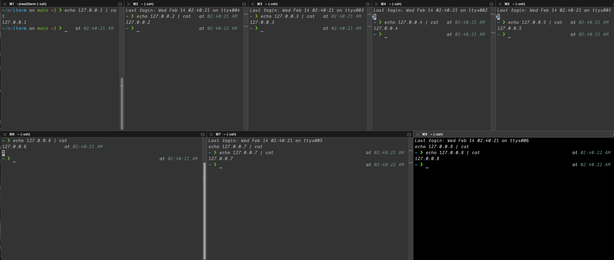

# iterm-scripts

## multi.sh

- Enable iterm2 python from scripts tab
- Every time you need to run command with multi pane run bash script to give targets and command
- Example: `sh multi.sh targets.txt 'clickhouse-client --host {hosts[i]}'`
- Open a iterm window than run the script via `cmd+shift+o` `multipane.py`.
- It will split a pane for each target and run the command.
- Feel free to copy/modify alias the script to your needs.

